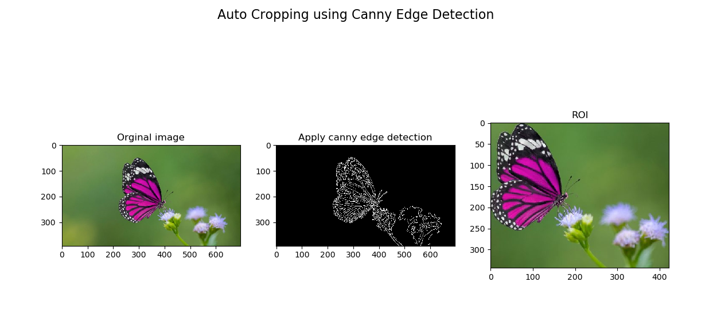
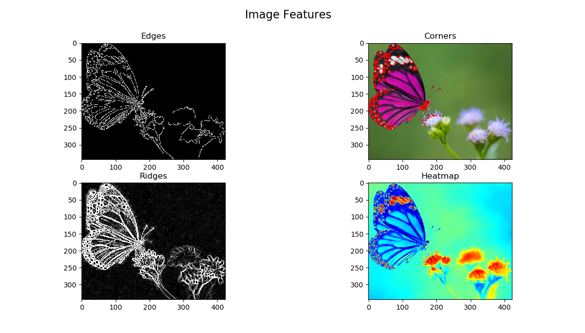

# Auto-Crop-Image
🖼 Auto Cropping Image using Canny Edge Detection in OpenCV 4

### Required Python Packages
```
$ pip install matplotlib
$ pip install opencv-contrib-python
$ pip install pywin32
```

## Results


